## Diagram autentykacji (MVP)

<authentication_analysis>
### Przepływy autentykacji wymagane w PRD i specyfikacji API
- Rejestracja użytkownika (email + hasło) oraz automatyczne zalogowanie.
- Logowanie użytkownika (email + hasło) z rate limitingiem po IP.
- Utrzymywanie sesji w UI na bazie tokenów JWT (access + refresh).
- Weryfikacja tokenu access przy każdym żądaniu do endpointów chronionych.
- Odświeżanie tokenów (wymiana refresh na nową parę access+refresh).
- Wylogowanie (unieważnienie tokenów po stronie serwera i po stronie UI).
- Reset hasła: żądanie linku oraz potwierdzenie z tokenem resetu.

### Aktorzy i interakcje
- Przeglądarka: użytkownik wchodzi w interakcje z UI.
- Frontend (React): zarządza stanem sesji i tokenami w localStorage.
- Backend API (Spring Boot): udostępnia endpointy auth i chronione zasoby.
- Filtr JWT: weryfikuje access token i ustawia kontekst bezpieczeństwa.
- Serwisy: Auth, JWT, rate limit, blacklist, reset hasła, email.
- Baza danych: przechowuje użytkownika i token resetu hasła.

### Tokeny i odświeżanie
- Access token: używany do autoryzacji żądań do API, weryfikowany w filtrze.
- Refresh token: używany do uzyskania nowej pary tokenów w endpointzie refresh.
- Blacklista: unieważnia tokeny po wylogowaniu i przy odświeżeniu refresh.

### Opis kroków (high-level)
- Rejestracja: walidacja → zapis usera → hashowanie hasła → wydanie tokenów.
- Logowanie: rate limit → weryfikacja hasła → wydanie tokenów.
- Żądanie chronione: filtr sprawdza token → ustawia Authentication → kontroler.
- Wygaśnięcie: filtr zgłasza błąd walidacji → brak sesji → odpowiedź 401.
- Refresh: walidacja refresh → blacklist starego → wydanie nowych tokenów.
- Logout: blacklist access (i opcjonalnie refresh) → UI czyści localStorage.
- Reset hasła: rate limit po email → zapis tokenu resetu → email → nowe hasło.

```mermaid
sequenceDiagram
autonumber

participant B as Przeglądarka
participant UI as Frontend React
participant API as Backend API
participant F as Filtr JWT
participant AC as Kontroler Auth
participant AS as Serwis Auth
participant PR as Serwis Reset
participant RL as Rate limit
participant JS as Serwis JWT
participant BL as Blacklista
participant DB as Baza danych
participant EM as Email

Note over B,UI: Start aplikacji i odtworzenie sesji z localStorage

activate UI
UI->>UI: Odczytaj access i refresh z localStorage
alt Tokeny są zapisane
  UI->>API: Pobierz bieżącego użytkownika z access tokenem
  activate API
  API->>F: Przetwórz żądanie
  activate F
  F->>JS: Waliduj access token
  alt Access token poprawny
    F->>BL: Sprawdź czy token jest unieważniony
    alt Token na blacklist
      F-->>API: Brak autoryzacji w kontekście
      API-->>UI: 401
      UI->>UI: Wyczyść localStorage i stan sesji
    else Token aktywny
      F-->>API: Ustaw Authentication w kontekście
      API->>AC: Zwróć informacje o użytkowniku
      AC->>AS: Pobierz usera po identyfikatorze
      AS->>DB: Odczyt usera
      DB-->>AS: User
      AS-->>AC: Dane użytkownika
      AC-->>UI: 200 + dane użytkownika
    end
  else Access token błędny lub wygasł
    F-->>API: Wyczyść kontekst bezpieczeństwa
    API-->>UI: 401
    UI->>UI: Wyczyść localStorage i stan sesji
  end
  deactivate F
  deactivate API
else Brak tokenów
  UI-->>B: Pokaż widok logowania lub rejestracji
end
deactivate UI

Note over B,API: Rejestracja i automatyczne zalogowanie

B->>UI: Wyślij formularz rejestracji
UI->>API: Żądanie rejestracji
activate API
API->>AC: Rejestracja
activate AC
AC->>AS: Utwórz konto
activate AS
AS->>DB: Sprawdź czy email istnieje
DB-->>AS: Wynik
alt Email już istnieje
  AS-->>AC: Błąd konfliktu
  AC-->>UI: 409
else Nowe konto
  AS->>AS: Hashuj hasło
  AS->>DB: Zapisz użytkownika
  DB-->>AS: User zapisany
  AS->>JS: Wygeneruj access token
  JS-->>AS: Access token
  AS->>JS: Wygeneruj refresh token
  JS-->>AS: Refresh token
  AS-->>AC: Dane + tokeny
  AC-->>UI: 201 + dane + tokeny
  UI->>UI: Zapisz tokeny i ustaw stan sesji
end
deactivate AS
deactivate AC
deactivate API

Note over B,API: Logowanie z rate limitingiem po IP

B->>UI: Wyślij formularz logowania
UI->>API: Żądanie logowania
activate API
API->>AC: Logowanie
activate AC
AC->>AS: Zweryfikuj dane logowania
activate AS
AS->>RL: Sprawdź limit prób po IP
alt Limit przekroczony
  RL-->>AS: Odrzuć
  AS-->>AC: Błąd limitu
  AC-->>UI: 429
else Limit OK
  RL-->>AS: OK
  AS->>DB: Pobierz usera po email
  DB-->>AS: User lub brak
  alt Błędne dane lub brak konta
    AS-->>AC: Błąd autoryzacji
    AC-->>UI: 401
  else Dane poprawne i konto aktywne
    AS->>JS: Wygeneruj access token
    JS-->>AS: Access token
    AS->>JS: Wygeneruj refresh token
    JS-->>AS: Refresh token
    AS-->>AC: Dane + tokeny
    AC-->>UI: 200 + dane + tokeny
    UI->>UI: Zapisz tokeny i ustaw stan sesji
  end
end
deactivate AS
deactivate AC
deactivate API

Note over B,API: Żądanie do zasobu chronionego po zalogowaniu

UI->>API: Żądanie zasobu chronionego (access token)
activate API
API->>F: Przetwórz żądanie
activate F
F->>JS: Waliduj access token
alt Token poprawny
  F->>BL: Sprawdź blacklist
  alt Token aktywny
    F-->>API: Ustaw Authentication w kontekście
    API-->>UI: 200 + dane zasobu
  else Token unieważniony
    F-->>API: Brak autoryzacji w kontekście
    API-->>UI: 401
    UI->>UI: Wyloguj lokalnie
  end
else Token wygasł
  F-->>API: Wyczyść kontekst bezpieczeństwa
  API-->>UI: 401
  UI->>UI: Wyloguj lokalnie
end
deactivate F
deactivate API

Note over B,API: Odświeżenie tokenów przy wygasłym access tokenie

UI->>API: Żądanie odświeżenia (refresh token)
activate API
API->>AC: Odśwież token
activate AC
AC->>AS: Wymień refresh na nową parę tokenów
activate AS
AS->>JS: Waliduj refresh token
AS->>BL: Sprawdź blacklist refresh
alt Refresh token niepoprawny lub unieważniony
  AS-->>AC: Błąd autoryzacji
  AC-->>UI: 401
  UI->>UI: Wyloguj lokalnie
else Refresh token poprawny
  AS->>DB: Pobierz usera po identyfikatorze
  DB-->>AS: User
  AS->>BL: Dodaj stary refresh token do blacklist
  AS->>JS: Wygeneruj nowy access token
  JS-->>AS: Nowy access token
  AS->>JS: Wygeneruj nowy refresh token
  JS-->>AS: Nowy refresh token
  AS-->>AC: Nowa para tokenów
  AC-->>UI: 200 + nowa para tokenów
  UI->>UI: Podmień tokeny w localStorage
end
deactivate AS
deactivate AC
deactivate API

Note over B,API: Wylogowanie i unieważnienie tokenu

alt MVP frontend
  UI->>UI: Wyczyść localStorage i stan sesji
else Wylogowanie z backendem
  UI->>API: Wyloguj z access tokenem
  activate API
  API->>AC: Logout
  activate AC
  AC->>AS: Unieważnij access token
  activate AS
  AS->>BL: Dodaj access token do blacklist
  BL-->>AS: OK
  AS-->>AC: OK
  AC-->>UI: 204
  UI->>UI: Wyczyść localStorage i stan sesji
  deactivate AS
  deactivate AC
  deactivate API
end

Note over B,API: Reset hasła i ochrona przed enumeracją

B->>UI: Poproś o reset hasła
UI->>API: Żądanie resetu hasła
activate API
API->>AC: Reset hasła
activate AC
AC->>PR: Zainicjuj reset
activate PR
PR->>RL: Sprawdź limit żądań po email
alt Limit przekroczony
  RL-->>PR: Odrzuć
  PR-->>AC: Błąd limitu
  AC-->>UI: 429
else Limit OK
  RL-->>PR: OK
  PR->>DB: Pobierz usera po email
  alt Użytkownik istnieje
    DB-->>PR: User
    PR->>DB: Zapisz token resetu i ważność
    PR->>EM: Wyślij email z tokenem resetu
  else Brak użytkownika
    DB-->>PR: Brak
    PR->>PR: Nie ujawniaj wyniku
  end
  PR-->>AC: Komunikat ogólny
  AC-->>UI: 200 + komunikat
end
deactivate PR
deactivate AC
deactivate API

B->>UI: Potwierdź reset hasła z tokenem
UI->>API: Potwierdzenie resetu hasła
activate API
API->>AC: Potwierdź reset
activate AC
AC->>PR: Ustaw nowe hasło
activate PR
PR->>DB: Znajdź usera po tokenie resetu
alt Token błędny
  PR-->>AC: Błąd autoryzacji
  AC-->>UI: 401
else Token wygasł
  PR-->>AC: Token wygasł
  AC-->>UI: 410
else Token poprawny
  PR->>PR: Hashuj nowe hasło
  PR->>DB: Zapisz nowe hasło i usuń token resetu
  DB-->>PR: OK
  PR-->>AC: OK
  AC-->>UI: 200
end
deactivate PR
deactivate AC
deactivate API
```

</authentication_analysis>

<mermaid_diagram>

</mermaid_diagram>

