<user_journey_analysis>
Poniższy diagram łączy wymagania z PRD (`.ai/prd.md`) z faktycznymi ścieżkami w UI (routy/widoki) i zachowaniami backendu (kontrolery/serwisy). Skupiam się na stanach biznesowych oraz decyzjach użytkownika, a nie na technicznych szczegółach endpointów.

## Ścieżki użytkownika (z PRD + kodu)
- Autentykacja:
  - Logowanie (z walidacją, obsługą błędów; przekierowanie do aplikacji po sukcesie).
  - Rejestracja (walidacja; po sukcesie auto-logowanie i wejście do aplikacji).
  - Odzyskiwanie hasła:
    - Żądanie linku resetu (komunikat “nie ujawniający” istnienia konta).
    - Ustawienie nowego hasła z tokenem (obsługa braku/niepoprawnego tokenu).
  - Wylogowanie (z menu użytkownika).

- Talie (Decks):
  - Wyświetlanie listy talii.
  - Tworzenie talii.
  - Edycja nazwy talii.
  - Usuwanie talii (z potwierdzeniem; kaskadowo usuwa fiszki).
  - Wejście w szczegóły talii.

- Fiszki (Flashcards):
  - Wyświetlanie fiszek w talii.
  - Dodanie fiszki manualnie.
  - Edycja fiszki (dla `ai` zmiana źródła na `ai-edited`).
  - Usuwanie fiszki (z potwierdzeniem).

- Tryb nauki:
  - Wejście w tryb nauki dla talii.
  - Przegląd fiszek (awers/rewers, następna/poprzednia).
  - Podsumowanie po ukończeniu.
  - Obsługa pustej talii.

- Generowanie fiszek przez AI:
  - Wybór talii (lub utworzenie nowej), modelu AI i liczby kandydatów + wklejenie tekstu.
  - Generowanie asynchroniczne (ekran ładowania z anulowaniem i retry).
  - Przegląd kandydatów (akceptuj/odrzuć/edytuj); stan przeglądu jest utrwalany, więc można wrócić później.
  - Zapis wsadowy zaakceptowanych/edytowanych fiszek do talii.
  - Obsługa błędów: brak dostępu, usunięta talia, rate limit, niedostępność AI, miesięczny limit generacji.

- Historia generowań AI:
  - Lista (read-only, paginowana) z podstawowymi metrykami.

## Główne podróże i stany
- Użytkownik niezalogowany → Autentykacja (logowanie/rejestracja/reset hasła) → Użytkownik zalogowany (aplikacja).
- Użytkownik zalogowany → Zarządzanie taliami → Zarządzanie fiszkami → Nauka.
- Użytkownik zalogowany → AI: formularz → generowanie → przegląd → zapis do talii.
- Użytkownik zalogowany → Historia generowań AI (podgląd) → powrót do talii.

## Punkty decyzyjne i alternatywne ścieżki
- Czy użytkownik ma konto? (logowanie vs rejestracja)
- Czy dane formularza są poprawne? (walidacja klienta/serwera)
- Czy logowanie/rejestracja się powiodły? (błędy vs sukces)
- (Weryfikacja e-mail) Czy konto wymaga weryfikacji? (w MVP konto jest aktywne od razu; weryfikacja jako możliwa przyszła ścieżka)
- Reset hasła: czy link zawiera token i czy jest ważny?
- Czy talia istnieje i czy użytkownik ma do niej dostęp?
- Nauka: czy talia ma fiszki?
- AI: czy użytkownik nie przekroczył limitów (rate limit / miesięczny limit), czy usługa jest dostępna?
- AI zapis: czy istnieją zaakceptowane/edytowane fiszki do zapisania i czy talia nadal istnieje?

## Cele stanów (krótko)
- Strony/formularze: umożliwiają wprowadzenie danych i uruchomienie akcji.
- Walidacja: zapewnia poprawność danych i szybkie błędy.
- Ekrany list/szczegółów: dają wgląd w zasoby i pozwalają wykonywać CRUD.
- Generowanie/Przegląd: prowadzi przez proces AI i selekcję kandydatów.
- Nauka/Podsumowanie: realizuje sesję nauki i domyka ją.
- Stany błędów: informują i oferują bezpieczny “powrót”/ponowienie.

```mermaid
stateDiagram-v2

[*] --> Niezalogowany

state "Użytkownik niezalogowany" as Niezalogowany {
  [*] --> StronaLogowania

  StronaLogowania --> FormularzLogowania: Wejście do aplikacji
  FormularzLogowania --> WalidacjaLogowania: Klik "Zaloguj"
  state if_logowanie <<choice>>
  WalidacjaLogowania --> if_logowanie
  if_logowanie --> Zalogowany: Dane poprawne
  if_logowanie --> BladLogowania: Dane błędne / limit prób
  BladLogowania --> FormularzLogowania: Popraw dane

  StronaLogowania --> FormularzRejestracji: Klik "Zarejestruj się"
  FormularzRejestracji --> WalidacjaRejestracji: Klik "Załóż konto"
  state if_rejestracja <<choice>>
  WalidacjaRejestracji --> if_rejestracja
  if_rejestracja --> RejestracjaSukces: Dane poprawne
  if_rejestracja --> BladRejestracji: Dane błędne / email zajęty
  BladRejestracji --> FormularzRejestracji: Popraw dane

  state if_weryfikacja_email <<choice>>
  RejestracjaSukces --> if_weryfikacja_email
  if_weryfikacja_email --> KontoAktywne: Brak weryfikacji (MVP)
  if_weryfikacja_email --> OczekujeNaWeryfikacje: Weryfikacja wymagana (opcjonalnie)
  OczekujeNaWeryfikacje --> KontoAktywne: Klik link w mailu
  KontoAktywne --> Zalogowany: Auto-logowanie / logowanie

  note right of if_weryfikacja_email
    W MVP konto jest aktywne od razu.
    Weryfikacja e-mail to opcjonalna ścieżka rozwojowa.
  end note

  state "Reset hasła" as ResetHasla {
    [*] --> ResetHaslaZadanie
    ResetHaslaZadanie: Formularz email
    ResetHaslaZadanie --> WalidacjaEmailResetu: Klik "Wyślij link"
    state if_reset_request <<choice>>
    WalidacjaEmailResetu --> if_reset_request
    if_reset_request --> KomunikatResetWyslany: Email poprawny
    if_reset_request --> BladResetuZadanie: Email błędny / błąd
    BladResetuZadanie --> ResetHaslaZadanie: Popraw dane

    KomunikatResetWyslany --> StronaLogowania: Powrót do logowania

    ResetHaslaPotwierdzenie: Formularz nowego hasła
    state if_token_reset <<choice>>
    ResetHaslaPotwierdzenie --> if_token_reset: Wejście z linku
    if_token_reset --> WalidacjaNowegoHasla: Token obecny
    if_token_reset --> BrakTokenuResetu: Brak/niepoprawny token
    BrakTokenuResetu --> ResetHaslaZadanie: Zażądaj nowego linku
    WalidacjaNowegoHasla --> if_reset_confirm
    state if_reset_confirm <<choice>>
    if_reset_confirm --> ResetHaslaSukces: Hasło zmienione
    if_reset_confirm --> BladResetuPotwierdzenie: Token wygasł / dane błędne
    BladResetuPotwierdzenie --> ResetHaslaPotwierdzenie: Spróbuj ponownie
    ResetHaslaSukces --> StronaLogowania: Komunikat sukcesu
  }

  StronaLogowania --> ResetHasla.ResetHaslaZadanie: Klik "Zapomniałeś hasła?"
  StronaLogowania --> ResetHasla.ResetHaslaPotwierdzenie: Wejście z linku resetu
}

state "Użytkownik zalogowany" as Zalogowany {
  [*] --> Talie

  state "Talie" as Talie {
    [*] --> ListaTalii
    ListaTalii: Lista talii
    ListaTalii --> TworzenieTalii: Klik "Utwórz talię"
    TworzenieTalii --> ListaTalii: Zapis / Anuluj

    ListaTalii --> EdycjaTalii: Klik "Edytuj"
    EdycjaTalii --> ListaTalii: Zapis / Anuluj

    ListaTalii --> UsuwanieTalii: Klik "Usuń"
    state if_potwierdz_usuniecie_talii <<choice>>
    UsuwanieTalii --> if_potwierdz_usuniecie_talii
    if_potwierdz_usuniecie_talii --> ListaTalii: Potwierdź
    if_potwierdz_usuniecie_talii --> ListaTalii: Anuluj

    ListaTalii --> Talia: Otwórz talię
  }

  state "Talia i fiszki" as Talia {
    [*] --> SzczegolyTalii
    SzczegolyTalii: Szczegóły talii
    state if_talia_istnieje <<choice>>
    SzczegolyTalii --> if_talia_istnieje: Wejście / odświeżenie
    if_talia_istnieje --> WidokFiszki: Talia dostępna
    if_talia_istnieje --> BladDostepuTalii: Brak dostępu / nie istnieje
    BladDostepuTalii --> Talie.ListaTalii: Wróć do listy

    WidokFiszki --> DodajFiszke: Klik "Dodaj fiszkę"
    DodajFiszke --> WidokFiszki: Zapis / Anuluj

    WidokFiszki --> EdytujFiszke: Klik "Edytuj"
    EdytujFiszke --> WidokFiszki: Zapis / Anuluj

    WidokFiszki --> UsunFiszke: Klik "Usuń"
    state if_potwierdz_usuniecie_fiszki <<choice>>
    UsunFiszke --> if_potwierdz_usuniecie_fiszki
    if_potwierdz_usuniecie_fiszki --> WidokFiszki: Potwierdź
    if_potwierdz_usuniecie_fiszki --> WidokFiszki: Anuluj

    WidokFiszki --> Talie.ListaTalii: Wróć do listy
  }

  state "Nauka" as Nauka {
    [*] --> StartNauki
    StartNauki: Uruchom tryb nauki
    state if_ma_fiszki <<choice>>
    StartNauki --> if_ma_fiszki
    if_ma_fiszki --> NaukaWToku: Są fiszki
    if_ma_fiszki --> PustaTalia: Brak fiszek
    PustaTalia --> SzczegolyTalii: Wróć do talii

    NaukaWToku: Przegląd fiszek (awers/rewers)
    NaukaWToku --> PodsumowanieNauki: Ostatnia fiszka
    PodsumowanieNauki --> StartNauki: Restart
    PodsumowanieNauki --> SzczegolyTalii: Wróć do talii
  }

  state "AI - generowanie fiszek" as AI {
    [*] --> FormularzAIGenerowania
    FormularzAIGenerowania: Formularz AI

    note right of FormularzAIGenerowania
      Użytkownik wybiera talię lub tworzy nową,
      wybiera model AI i liczbę kandydatów,
      wkleja tekst źródłowy.
    end note

    FormularzAIGenerowania --> TworzenieTalii: Utwórz nową talię (opcjonalnie)
    FormularzAIGenerowania --> WalidacjaAIGenerowania: Klik "Generuj"
    state if_ai_form <<choice>>
    WalidacjaAIGenerowania --> if_ai_form
    if_ai_form --> GenerowanieAI: Dane poprawne
    if_ai_form --> BledyAIGenerowania: Dane niepoprawne
    BledyAIGenerowania --> FormularzAIGenerowania: Popraw dane

    GenerowanieAI: Ekran ładowania
    GenerowanieAI --> FormularzAIGenerowania: Anuluj i wróć
    state if_ai_generate <<choice>>
    GenerowanieAI --> if_ai_generate: Zakończenie generowania
    if_ai_generate --> PrzegladKandydatow: Sukces
    if_ai_generate --> BladGenerowaniaAI: Błąd / limit / niedostępność
    BladGenerowaniaAI --> GenerowanieAI: Spróbuj ponownie
    BladGenerowaniaAI --> FormularzAIGenerowania: Wróć do formularza

    PrzegladKandydatow: Akceptuj / Odrzuć / Edytuj
    PrzegladKandydatow --> PrzegladKandydatow: Zapisz decyzję kandydata
    PrzegladKandydatow --> PrzegladKandydatow: Powrót później (sesja trwa)

    note right of PrzegladKandydatow
      Sesja przeglądu jest utrwalana,
      więc można odświeżyć stronę i kontynuować.
    end note

    state if_ma_do_zapisu <<choice>>
    PrzegladKandydatow --> if_ma_do_zapisu: Klik "Zapisz do talii"
    if_ma_do_zapisu --> ZapisDoTalii: Są zaakceptowane/edytowane
    if_ma_do_zapisu --> BladBrakWyboru: Nic do zapisania
    BladBrakWyboru --> PrzegladKandydatow: Wróć do wyboru

    state if_zapis_ok <<choice>>
    ZapisDoTalii --> if_zapis_ok
    if_zapis_ok --> SzczegolyTalii: Zapis udany
    if_zapis_ok --> BladZapisuDoTalii: Błąd / talia usunięta
    BladZapisuDoTalii --> PrzegladKandydatow: Wróć do przeglądu
  }

  state "Historia generowań AI" as HistoriaAI {
    [*] --> ListaGenerowan
    ListaGenerowan: Lista (paginacja, bez akcji)
    ListaGenerowan --> ListaGenerowan: Zmień stronę
    ListaGenerowan --> Talie.ListaTalii: Wróć do talii
  }

  Talie.ListaTalii --> Nauka.StartNauki: Klik "Ucz się" (na talii)
  Talia.SzczegolyTalii --> Nauka.StartNauki: Klik "Ucz się"

  Talie.ListaTalii --> AI.FormularzAIGenerowania: Klik "Generuj fiszki (AI)"
  Talia.SzczegolyTalii --> AI.FormularzAIGenerowania: Klik "Generuj (dla tej talii)"

  Talie.ListaTalii --> HistoriaAI.ListaGenerowan: Klik "Historia generowań"
}

Zalogowany --> Niezalogowany: Wyloguj

state "Nieznany adres" as NotFound
Niezalogowany --> NotFound: Wejście w nieistniejącą stronę
Zalogowany --> NotFound: Wejście w nieistniejącą stronę
NotFound --> Niezalogowany.StronaLogowania: Przejdź do logowania
NotFound --> Zalogowany.Talie.ListaTalii: Przejdź do talii
```

</user_journey_analysis>

<mermaid_diagram>

</mermaid_diagram>

