## Diagram UI (MVP)

<architecture_analysis>
### Komponenty i moduły zidentyfikowane w codebase (wysoki poziom)

#### Shell aplikacji i routing
- `main.tsx`: `AuthProvider` opakowuje `App`
- `App.tsx`: `RouterProvider`
- `routes/router.tsx`: definicja tras (auth, decks, AI, study, not-found)

#### Stan sesji i strażnicy tras
- `AuthProvider` / `AuthContext` / `useAuth`
- `tokenStorage` (localStorage tokenów)
- `AuthGuard` (odsyła zalogowanych z widoków auth do panelu)
- `ProtectedRoute` (chroni widoki wymagające zalogowania)
- `UserMenu` (logout + pokaz email)

#### Widoki (strony)
- Auth:
  - `LoginView`
  - `RegisterView`
  - `PasswordResetRequestView`
  - `PasswordResetConfirmView`
- Talie i fiszki:
  - `DecksView`
  - `DeckDetailsView`
- Nauka:
  - `StudyView`
- AI:
  - `AIGenerateView`
  - `AILoadingView`
  - `AIReviewView`
  - `AIGenerationsHistoryView`
- Pozostałe:
  - `NotFoundView`

#### Komponenty UI (wybrane, kluczowe dla przepływów)
- Auth UI: `AuthLayout`, `AuthCard`, `LoadingButton`, `InlineError`, `PasswordRequirementsHint`
- Decks UI: `DecksHeader`, `DeckGrid`, `DeckCard`, `CreateDeckDialog`, `EditDeckDialog`, `ConfirmDeleteDialog`
- Deck details UI: `DeckHeader`, `FlashcardList`, `FlashcardCard`, `FlashcardSourceBadge`, `CreateFlashcardDialog`, `EditFlashcardDialog`, `ConfirmDeleteFlashcardDialog`, `EmptyFlashcardsState`
- Study UI: `StudyLayout`, `StudyTopBar`, `StudyCard`, `StudyControls`, `StudySummary`, `StudyEmptyState`
- AI UI: `AIGenerateForm`, `DeckSelect`, `AIModelSelect`, `TextareaWithCounter`, `AITriviaLoading`, `CandidateGrid`, `CandidateCard`, `EditCandidateDialog`, `AIGenerationHeader`, (history) `AIGenerationsHistoryHeader/Table/EmptyState`
- Wspólne: `PaginationControls`, `NotFoundState`

#### Warstwa API i walidacji
- API klient: `httpClient.fetchJson`
- Parser błędów: `errorParser.getErrorMessage`, `errorParser.handleApiError`
- API moduły: `authApi`, `decksApi`, `flashcardsApi`, `aiApi`
- Walidacje: `validateEmail`, `validatePassword`, `validateGenerateForm`
- Allow-list modeli: `aiModels` (stałe + `isValidAIModelId`)

### Główne strony i ich kompozycja
- Widoki auth: `AuthGuard` → `AuthLayout` → `AuthCard` → formularz + `LoadingButton` + `InlineError`
- Widoki chronione: `ProtectedRoute` → kontener widoku → (opcjonalnie) `UserMenu` + UI domenowe
- AI generowanie: formularz → loading → review (akcje per kandydat) → zapis do talii
- Decks: lista → szczegóły talii → CRUD fiszek → start nauki

### Przepływ danych (skrót)
- Komponenty widoków używają `useAuth` (tokeny, logout) oraz wywołują funkcje z warstwy `lib/api/*`.
- `httpClient` zwraca dane albo rzuca `ApiError`; UI mapuje na komunikaty przez `errorParser`.
- Walidacje klienta:
  - auth: `validateEmail`, `validatePassword`
  - AI generate/loading: `validateGenerateForm` (deck + model + tekst + liczba kandydatów)

### Opis funkcjonalny kluczowych elementów
- `AuthProvider`: odtwarza sesję z localStorage, pobiera dane użytkownika, wystawia `login/register/logout`.
- `AuthGuard`/`ProtectedRoute`: wymuszają poprawny dostęp do tras (zależnie od stanu sesji).
- `AIGenerateView`/`AILoadingView`/`AIReviewView`: implementują pełny flow generowania i przeglądu kandydatów oraz zapis do talii.

```mermaid
flowchart TD
  %% =========================
  %% Shell aplikacji
  %% =========================
  A0((Start)) --> A1["Inicjalizacja React"]
  A1 --> A2["Provider sesji (AuthProvider)"]:::updated
  A2 --> A3["Router aplikacji (RouterProvider)"]
  A2 -.-> A4[["Magazyn tokenów (localStorage)"]]
  A2 -.-> A5["Odtworzenie sesji i pobranie profilu"]:::updated

  %% =========================
  %% Strażnicy dostępu
  %% =========================
  subgraph G0["Strażnicy dostępu"]
    direction TB
    G1{"Czy użytkownik zalogowany?"}
    G2["AuthGuard (blokuje widoki auth)"]
    G3["ProtectedRoute (chroni widoki)"]
  end

  A2 --> G1
  G1 -- "nie" --> G2
  G1 -- "tak" --> G3

  %% =========================
  %% Moduł autentykacji
  %% =========================
  subgraph AU0["Moduł autentykacji"]
    direction TB
    AU1["Widok: Logowanie"]
    AU2["Widok: Rejestracja"]
    AU3["Widok: Reset hasła (prośba)"]
    AU4["Widok: Reset hasła (ustawienie)"]

    AU5["Komponenty: Layout + Card"]
    AU6["Komponenty: Formularz + LoadingButton"]
    AU7["Komponenty: InlineError + komunikaty"]
    AU8["Walidacja danych wejściowych"]
  end

  G2 --> AU1
  G2 --> AU2
  G2 --> AU3
  G2 --> AU4

  AU1 --> AU5 --> AU6 --> AU7
  AU2 --> AU5
  AU3 --> AU5
  AU4 --> AU5
  AU6 --> AU8

  AU1 -- "sukces logowania" --> D1
  AU2 -- "sukces rejestracji" --> D1
  AU4 -- "sukces resetu" --> AU1

  %% =========================
  %% Moduł talie i fiszki
  %% =========================
  subgraph DK0["Moduł talie i fiszki"]
    direction TB
    D1["Widok: Lista talii"]
    D2["Komponent: Nagłówek listy"]
    D3["Komponent: Siatka talii"]
    D4["Dialogi: Utwórz / Edytuj / Usuń talię"]

    DD1["Widok: Szczegóły talii"]
    DD2["Komponent: Nagłówek talii"]
    DD3["Komponent: Lista fiszek"]
    DD4["Dialogi: Utwórz / Edytuj / Usuń fiszkę"]
  end

  G3 --> D1
  G3 --> DD1

  D1 --> D2 --> D3
  D1 -.-> D4

  D1 -- "wybór talii" --> DD1
  DD1 --> DD2 --> DD3
  DD1 -.-> DD4

  %% =========================
  %% Moduł nauki
  %% =========================
  subgraph ST0["Moduł nauki"]
    direction TB
    S1["Widok: Nauka"]
    S2["Layout: Tryb skupienia"]
    S3["TopBar: postęp + powrót"]
    S4["Karta nauki"]
    S5["Kontrolki nawigacji"]
    S6["Podsumowanie sesji"]
    S7["Empty state (pusta talia)"]
  end

  G3 --> S1
  DD1 -- "start nauki" --> S1
  D1 -- "start nauki" --> S1

  S1 --> S2 --> S3
  S1 --> S4 --> S5
  S1 --> S6
  S1 --> S7

  %% =========================
  %% Moduł AI
  %% =========================
  subgraph AI0["Moduł AI"]
    direction TB
    AI1["Widok: Generowanie (formularz)"]:::updated
    AI2["Komponent: Formularz generowania"]:::updated
    AI3["Pole: Wybór talii"]
    AI4["Pole: Wybór modelu"]:::updated
    AI5["Pole: Tekst źródłowy"]
    AI6["Pole: Liczba kandydatów"]
    AI7["Walidacja formularza"]:::updated

    AI8["Widok: Loading generowania"]:::updated
    AI9["Komponent: Trivia + spinner"]

    AI10["Widok: Review kandydatów"]
    AI11["Header: metryki + zapis"]
    AI12["Siatka kandydatów"]
    AI13["Karta kandydata"]
    AI14["Dialog: Edycja kandydata"]

    AI15["Widok: Historia generowań"]
    AI16["Tabela historii + paginacja"]
  end

  G3 --> AI1
  G3 --> AI8
  G3 --> AI10
  G3 --> AI15

  D1 -- "przejście do AI" --> AI1
  DD1 -- "AI dla tej talii" --> AI1
  D1 -- "historia AI" --> AI15

  AI1 --> AI2
  AI2 --> AI3
  AI2 --> AI4
  AI2 --> AI5
  AI2 --> AI6
  AI2 --> AI7

  AI1 -- "submit" --> AI8
  AI8 --> AI9
  AI8 -- "sukces generowania" --> AI10

  AI10 --> AI11
  AI10 --> AI12 --> AI13
  AI13 -- "edycja" --> AI14
  AI10 -- "zapis do talii" --> DD1

  AI15 --> AI16

  %% =========================
  %% Obsługa błędów i nawigacja pomocnicza
  %% =========================
  subgraph NF0["Obsługa braków i błędów nawigacji"]
    direction TB
    N1["Widok: Nie znaleziono"]
    N2["Komponent: Stan 404 + CTA"]
  end
  A3 --> N1
  N1 --> N2

  %% =========================
  %% Wspólne komponenty i menu użytkownika
  %% =========================
  subgraph SH0["Wspólne elementy UI"]
    direction TB
    U1["UserMenu (wyloguj)"]
    C1["InlineError (komunikaty)"]
    C2["PaginationControls"]
  end

  D1 -.-> U1
  AI1 -.-> U1
  AI8 -.-> U1
  AI10 -.-> U1

  %% =========================
  %% Warstwa API i narzędzia
  %% =========================
  subgraph API0["Warstwa API i narzędzia"]
    direction TB
    H1[["HTTP Client (fetchJson)"]]
    E1[["Parser błędów (errorParser)"]]
    V1[["Walidacje: email / hasło"]]
    V2[["Walidacje: generowanie AI"]]

    AP1["API: Autentykacja"]
    AP2["API: Talie"]
    AP3["API: Fiszki"]
    AP4["API: AI"]:::updated
    AP5["API: Nauka"]

    M1["Allow-list modeli AI"]:::updated
  end

  AU8 -.-> V1
  AI7 -.-> V2
  AI4 -.-> M1

  AU1 -.-> AP1
  AU2 -.-> AP1
  AU3 -.-> AP1
  AU4 -.-> AP1

  D1 -.-> AP2
  DD1 -.-> AP2
  DD1 -.-> AP3
  S1 -.-> AP5

  AI8 -.-> AP4
  AI10 -.-> AP4
  AI15 -.-> AP4

  AP1 --> H1
  AP2 --> H1
  AP3 --> H1
  AP4 --> H1
  AP5 --> H1

  AU1 -.-> E1
  D1 -.-> E1
  DD1 -.-> E1
  S1 -.-> E1
  AI8 -.-> E1
  AI10 -.-> E1
  AI15 -.-> E1

  %% =========================
  %% Style
  %% =========================
  classDef updated fill:#f96,stroke:#333,stroke-width:2px;
```

</architecture_analysis>

<mermaid_diagram>

</mermaid_diagram>

